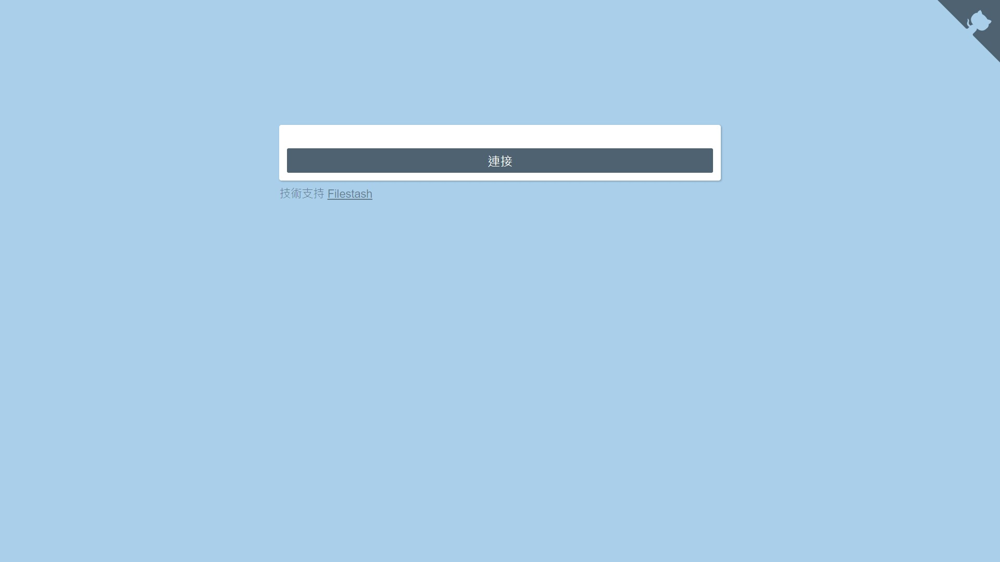
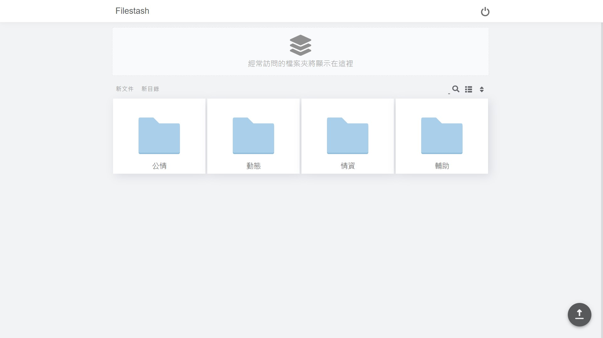
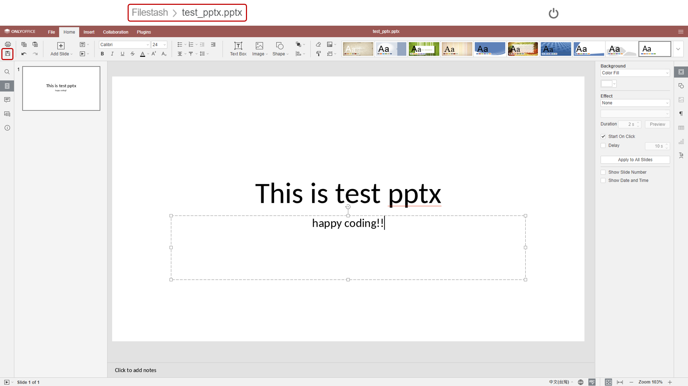

# s3-web-client 使用說明

因為在LINE準備開會討論的項目時，有時候需要丟檔案，
但不是每個地方都可以隨時都可以開 LINE，寄 Email 也不方便，
雖然 HackMD 可以貼連結，但檔案如果又要存放在各自的位置，管理上也很麻煩。

所以就想用 TWCC-MOD內部測試計畫，開一個 s3 bucket 空間，
並利用 filestash(+DocumentServer) 開源專案，建一個可以在 web 端入口，
讓大家可以把需要討論的檔案放在上面。

- 使用國網資源: TWCC-VM (最小規格，OS 為 ubuntu-18.04)、s3空間。
- 優點:
    - 鎖IP網域為 140.110.XXX.XXX
    - 統一窗口，以後大家討論的事項，不論文字或是檔案，就都在 HackMD 上面即可完成。
    - 放上去的檔案如果討論時臨時需要修改，也可以線上修改、分享。
    - 使用空間為該專案下的 TWCC-COS(s3) 空間。
- 缺點:
    - 安全性: 畢竟是使用開源專案，HackMD 也是公開的，所以放置可討論的文件即可。
    - 檔案大小傳輸受到瀏覽器限制。

---

## 可以修正的部分

- 加設密碼: 但我怕這樣層層關卡太多(還要記錄密碼)，所以我就讓大家點擊「連結」就可以登入了。

---

## 使用說明

step 01. 登入

step 02. 選擇相應的資料夾

step 03. 可直接將檔案拖拉上傳，或是右下角有上傳按鍵

上傳完成後右下角會有提示出現。
檔案右上角的 icon 依序為「更改檔名、刪除檔案、分享檔案」，
其中分享檔案可設定權限為「編輯者」或「觀看者」。

step 04. 編輯、存檔與退出

存檔請按左上角的儲存鍵。(如果是 txt 檔案則為 auto save，其餘則需要點擊存檔才會儲存修改的內容。)
退出則直接點擊上面的路徑階層即可。

---

## END
